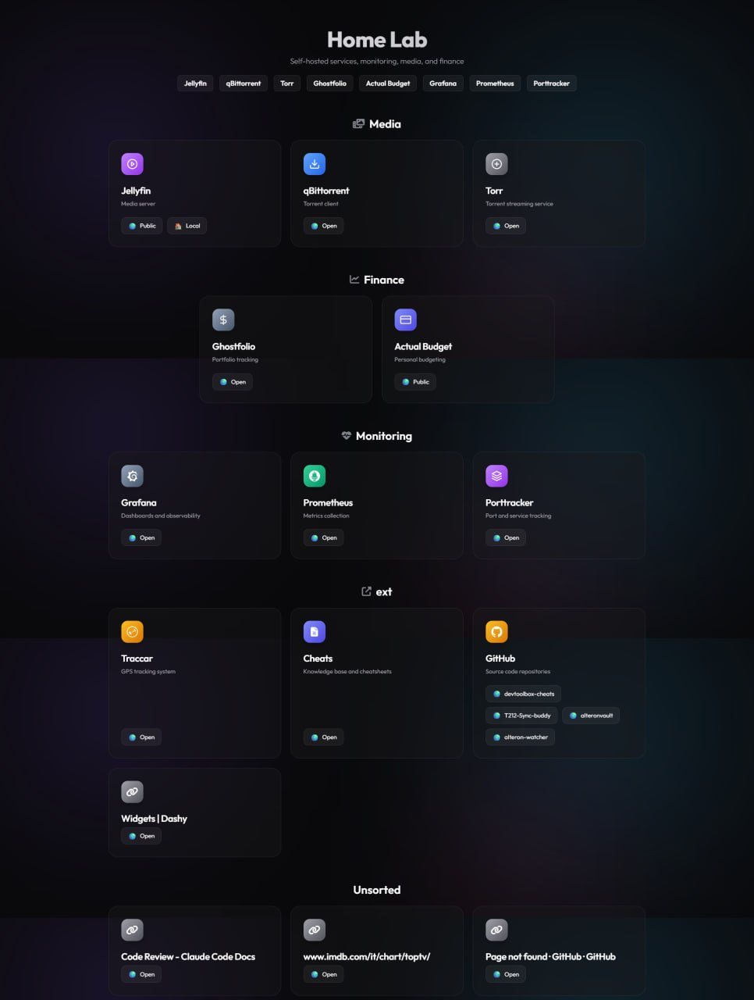
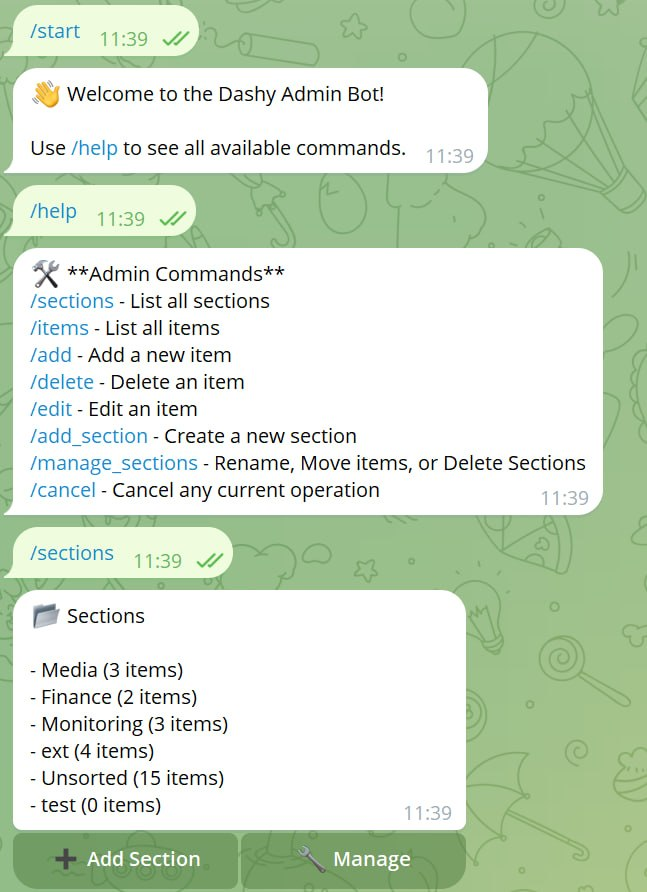
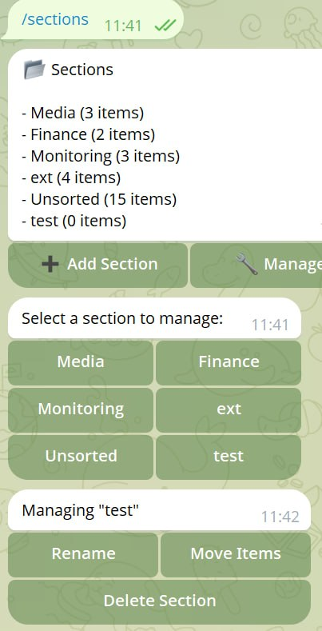
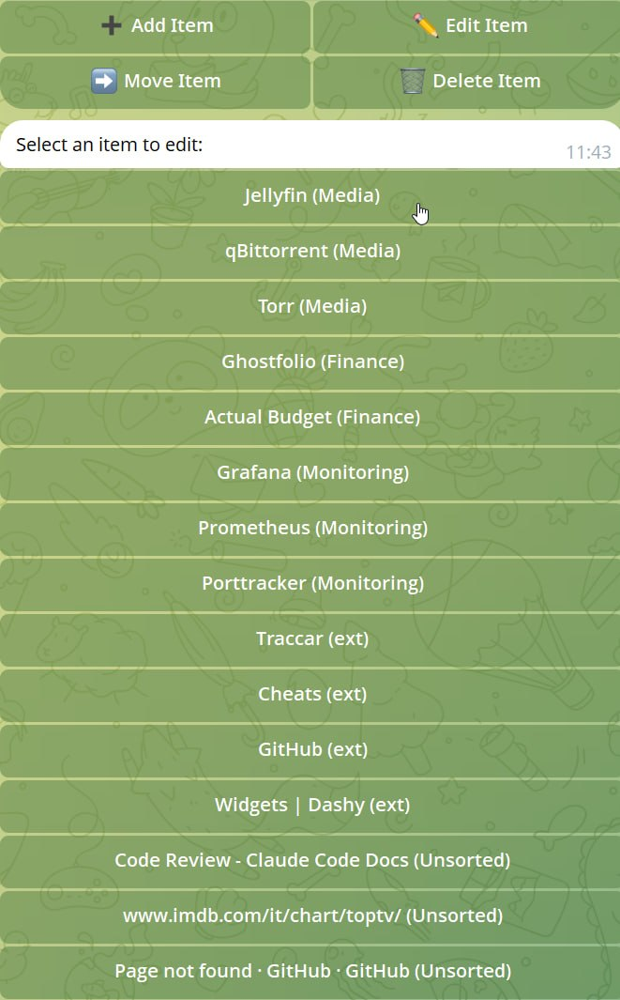
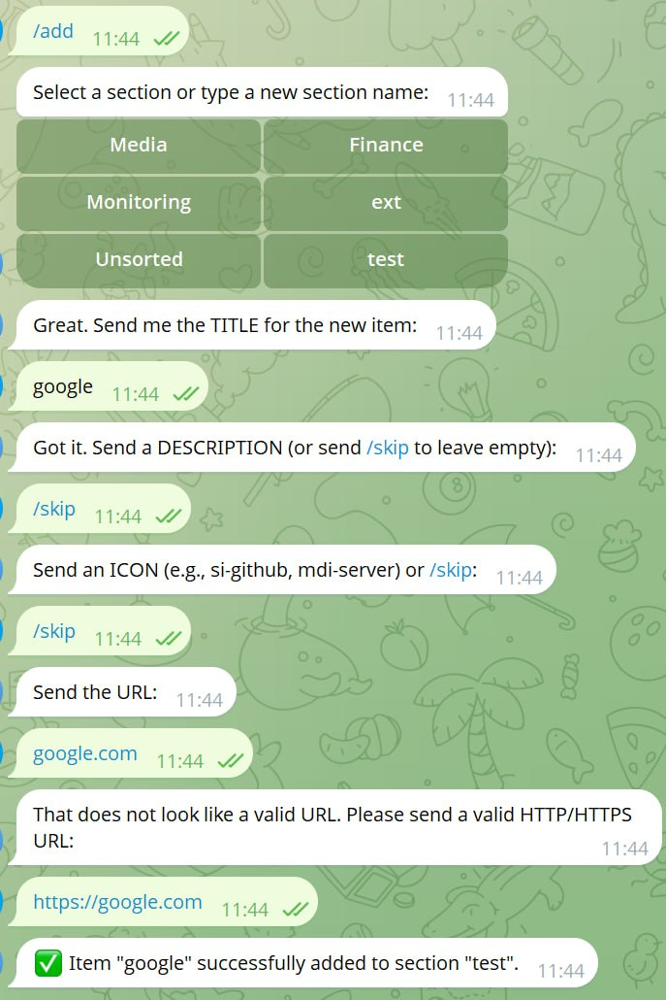
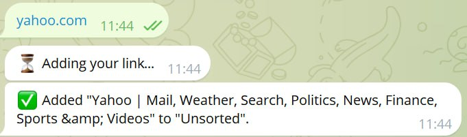

# Telegram Dashy Admin Bot 🤖


A lightweight, secure, and fully Dockerized Telegram bot, powered by the [Telegraf](https://telegraf.js.org/) framework, designed to manage your self-hosted Dashy-style dashboard configuration (`conf.yml`). 

By bridging a Telegram chat interface directly to your YAML file, this bot acts as a specialized CRUD (Create, Read, Update, Delete) administrator. It utilizes interactive multi-step wizards for adding items and robust inline-keyboards for modifications, completely removing the hassle of SSH/terminal YAML editing.

Also includes a standalone PHP dashboard to render your conf.yml without Dashy.
## Example Screenshots



<details>
<summary>Screenshots from Telegram Bot</summary>





</details>

## ✨ Features

- **Telegraf Framework**: Powered by the robust Telegraf framework, leveraging its Scenes architecture for complex, multi-step conversational workflows.
- **Strict User Authorization**: Locked down via a strict internal allowlist so only you (or designated friends/family) can access the bot functionality.
- **Smart Link Auto-Add**: Simply dispatch a bare URL message to the bot. It will attempt to scrape the website's title and intelligently categorize the link inside an "Unsorted" boundary.
- **Atomic File Operations**: Uses a secure temp-file copy/rename pipeline behind the scenes (`.conf.yml.tmp`) ensuring your PHP dashboard never reads a half-written configuration.
- **Interactive Wizards**: Guides you step-by-step through adding new Items (Title, Description, Icon, Validated URL).
- **Clean Inline Keyboards**: Simplifies navigation through deleting configuration elements natively via Telegram's tap interfaces.
- **Docker First**: Provides multi-stage lightweight builds (Alpine Linux) with drop-in compose files mapping directly to your existing host dashboard config.

## 🛠️ Technology Stack

- **Runtime Environment:** Node.js 20 (Alpine)
- **Language Setup:** TypeScript (ES2022)
- **API Framework:** Telegraf (Telegram Bot API wrapper)
- **Data Serialization:** `yaml`
- **Error/Logging:** `pino` & `pino-pretty`
- **Validation Constraints:** `zod`

---
---


If you like this project, consider supporting me on [Buy Me a Coffee](https://www.buymeacoffee.com/dominatos) ?☕️

---
## 🖥️ PHP Dashboard (index.php)

The `index.php` file included in this repository provides a lightweight, self-contained PHP dashboard that renders a Dashy-compatible `conf.yml` as a modern, dark-themed web page. It operates entirely independently of Dashy, meaning you don't need to run the full Dashy stack to get a beautiful dashboard with an animated blob gradient background and glassmorphism cards.

### 📋 Requirements

*   **PHP 8+**
*   **Python 3**
*   **PyYAML** (`python3-yaml` via apt or `pip install PyYAML`)

### ⚡ Quick Setup

1. Copy the `index.php` file so it sits right next to your `conf.yml` file.
2. Serve the directory using your preferred web server (such as Apache or Nginx) or quickly spin up PHP's built-in development server:
   ```bash
   php -S localhost:8080
   ```
3. Open `http://localhost:8080` in your web browser.

### ✨ Features

*   **Zero Build Dependencies:** No Node.js, `npm`, or Docker needed.
*   **Smart Icon Fallback Chain:** Automatically resolves icons in priority order: Hardcoded special map (Tandoor, n8n, etc.) ➔ Simple Icons CDN (`si-`) ➔ Font Awesome (`fa`) ➔ Material Design Icons (`mdi-`) ➔ Generic SVG fallback.
*   **`subItems` Multi-Link Support:** Display multiple distinct links (e.g., Local, Network, Public) within a single service card with emoji prefixes.
*   **Responsive Grid:** Fully fluid layout adapting dynamically to desktops, tablets, and mobile screens.

### 📝 Example `conf.yml` Structure

```yaml
pageInfo:
  title: "My Home Server"
  description: "Centralized access portal"
  navLinks:
    - title: "GitHub Repo"
      path: "https://github.com/"
  footerText: "Running smoothly on self-hosted infrastructure."

sections:
  - name: "Media Services"
    icon: "fa-solid fa-play"
    items:
      - title: "Jellyfin"
        description: "Open source media server"
        icon: "si-jellyfin"
        subItems:
          - title: "🏠 Local"
            url: "http://192.168.1.100:8096"
          - title: "🌍 Public"
            url: "https://media.example.com"
```

> **💡 Note:** This PHP dashboard reads the exact same `conf.yml` used by the Telegram bot. Any additions, edits, or reordering you perform via the Telegram bot will instantly be synced and reflected on your live dashboard!

---
## 🚀 Setup & Installation

### 1. Requirements
Ensure you have Docker and Docker Compose installed.

### 2. Generate Telegram Credentials
1. **Bot Token**: Message [@BotFather](https://t.me/botfather) on Telegram, use `/newbot`, name it, and copy the resulting `HTTP API Token`.
2. **User ID**: Message [@userinfobot](https://t.me/userinfobot) (or equivalent) to retrieve your personal numerical Telegram ID.

### 3. Configure the Environment
Clone or navigate to this folder and copy the environment template:
```bash
cp .env.example .env
```
Open `.env` in your text editor and populate the variables:
```env
# Telegram Bot Token from BotFather
BOT_TOKEN=123456789:YOUR_VERY_LONG_TELEGRAM_TOKEN_HERE

# Comma-separated list of allowed Telegram user IDs
ALLOWED_USER_IDS=12345678,87654321

# Optional: Path to where your conf.yml lives.
# If omitted, defaults to the parent directory (`../conf.yml`). 
# You can set this to any absolute path (e.g. /var/www/html/conf.yml) and Docker will dynamically mount it.
CONF_PATH=../conf.yml
```

---

## 🐳 Deployment (Docker Compose)

The provided `docker-compose.yml` dynamically mounts the exact file location defined by `CONF_PATH` inside your `.env` file directly into the container. 

If you leave `CONF_PATH` blank or omitted, it gracefully falls back to looking for `../conf.yml`. This allows you to store your dashboard configuration globally anywhere on your host filesystem (like `/var/www/html/conf.yml`) and gracefully wire it right into the bot without editing the compose file.

Launch the system detached:
```bash
docker compose up -d --build
```
*Note: This will perform a multi-stage background build to strip development dependencies before running the bot container.*

**Useful Docker Commands**:
- Read Live Logs: `docker compose logs -f`
- Restart Bot: `docker compose restart`
- Shut down: `docker compose down`

---

## 💻 Local Development (Without Docker)

If modifying the bot natively or running without containers, utilize `npm`:

```bash
npm install
npm run dev
```

*Be aware that `CONF_PATH` inside `.env` dictates exactly where the YAML parser intends to edit the target config when run locally.*

---

## 📱 Bot Commands Manual

Interact with your active Telegram bot using these standard commands:

* `/start` - Displays a welcome message and removes any persistent custom reply keyboards.
* `/help` - Prints administrative command guidelines.
* `/sections` - Lists all currently configured Sections with an inline keyboard to Add or Manage sections.
* `/items` - Prints an expanded hierarchy list of every item with an inline keyboard to Add, Edit, Move, or Delete items.
* `/add` - Mounts the **Addition Wizard Scene**. The bot will conversationally prompt you for:
  1. Section Name (or creation of a new one)
  2. Item Title
  3. Item Description (Optional via `/skip`)
  4. Dashy/Premium String Icon Reference (Optional via `/skip`)
  5. URL Constraints (Must pass URL parsing evaluation)
* `/edit` - Mounts the **Edit Item Scene** to modify an existing item.
* `/add_section` - Mounts the **Add Section Scene** to create a new section.
* `/manage_sections` - Mounts the **Manage Section Scene** to rename, move items, or delete sections.
* `/navlinks` - Mounts the **NavLinks Scene** to add or delete top-level navigation bar links (the pill buttons shown above the dashboard sections).
* `/sublinks` - Mounts the **Sub-Links Scene** to add or remove individual links inside an item card. When adding the first sub-link to an item that already has a single URL, it auto-converts that URL into an "Open" sub-link so nothing is silently lost.
* `[Raw HTTP/HTTPS Link]` - If you message the bot a standalone URL, it bypasses the wizard and automatically extracts the `<title>` element (or defaults to the URL path). It instantly injects the new link into a category titled **"Unsorted"**.
* `/delete` - Queries all items, binding them to an inline callback-keyboard. Selecting an item instantly wipes it from the `conf.yml`.
* `/cancel` - Kills your active wizard workflow securely (specifically required if you get trapped inside prompts and want to back out).

---

## 🗃️ Folder Structure
```text
index.php                  # PHP Dashboard
conf.yml                   # YAML Configuration
/tg-admin-bot/
├── src/
│   ├── index.ts           # Telegraf polling entry point 
│   ├── config.ts          # Zod validation and .env processing
│   ├── bot/
│   │   ├── middleware.ts  # Authorizing traffic payload user ID validation
│   │   ├── commands.ts    # Handlers for base /slash routines
│   │   ├── scenes.ts      # Multi-step stateful workflows wizard (/add)
│   │   └── actions.ts     # Callback handlers for inline button presses 
│   ├── service/
│   │   └── yamlAdmin.ts   # FS Atomic configuration I/O logic 
│   └── utils/
│       └── logger.ts      # Pino logging formats
├── Dockerfile             # Multi-stage container definitions
├── docker-compose.yml     # Compose volume and env mapping configurations
├── .env.example           # Example runtime definitions
└── README.md
```

---


If you like this project, consider supporting me on [Buy Me a Coffee](https://www.buymeacoffee.com/dominatos) ☕️

---
